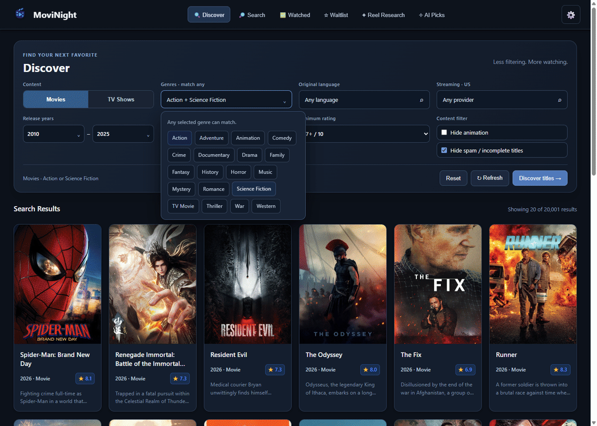

A modern, fast, and beautiful movie and TV show discovery application built with Tauri v2.



## ✨ Features

- **🔍 Advanced Discovery**: Filter movies and TV shows by genre, year, language, and streaming providers
- **🔎 Smart Search**: Search by title across both movies and TV shows simultaneously  
- **📋 Watchlist Management**: Keep track of what you want to watch and what you've already seen
- **🎬 Trailer Integration**: Watch trailers directly in the app with embedded YouTube player
- **📱 Responsive Design**: Beautiful UI that works on all screen sizes
- **⚡ Fast & Lightweight**: Built with Rust backend for optimal performance
- **🔒 Secure**: Your data stays local - no cloud sync required
- **🌐 Cross-Platform**: Works on Windows, macOS, and Linux

## Version 1.1.0

Discover now uses compact dropdown filters with **match-any** genres, refreshed API caching, paginated title search, accessible rainbow card rims, and dismissible notifications.

**Reel Research** stores pasted titles/tables for a connected AI agent. Start the local **MCP Server** in Settings, configure your client, and copy the agent guide. AI matches stay in a separate review queue until you approve them in Waitlist. **AI Picks** holds recommendations from your existing watched history or approved waitlist.

See [MCP_GUIDE.md](MCP_GUIDE.md) for connection examples, tools, prompts, and cache rules. There is no embedded AI model: research and recommendation reasoning come from your connected MCP client.

### Safe upgrades

Install the 1.1.0 installer over the existing app using the same installation scope. The application identifier (`com.movinight.app`) and saved-data folder (`%APPDATA%\movinight` on Windows) are unchanged. No uninstall or cache cleanup is needed. Existing watched dates and tracked seasons are retained. Atomic writes preserve the last good file, originals are backed up under `backups/before-1.1.0`, and Settings offers a manual library backup. AI data is in a separate `ai_workspace.json`. If a saved file cannot be parsed, the app reports the error instead of replacing it.

### Validation

- `npm run check`: JavaScript syntax.
- `npm run test:backend`: storage compatibility, backup preservation, genre union, cache expiry/coalescing, approval idempotency, and MCP protocol/security tests.
- `npm run build`: production Tauri installers.

The optional `tests/runtime-check.cjs` and `tests/responsive-check.cjs` use Playwright against a **debug-only isolated** Tauri WebView on port 9229. Install Playwright separately or set `MOVINIGHT_PLAYWRIGHT_PATH` to an existing Playwright module. Launch a debug build with `MOVINIGHT_QA_DATA_DIR` set to the absolute `.qa-data` directory, `WEBVIEW2_USER_DATA_FOLDER` set to an isolated WebView profile, and `WEBVIEW2_ADDITIONAL_BROWSER_ARGUMENTS=--remote-debugging-port=9229`. Copy your saved files into `.qa-data` first. The QA directory and screenshots are ignored by Git. These tests stage and approve titles only in that isolated library. Release builds ignore the QA data-directory override.

### Development

1. **Clone the repository**
   ```bash
   git clone https://github.com/mahostar/movinight
   cd movinight
   ```

2. **Install dependencies**
   ```bash
   npm install
   ```

3. **Start development server**
   ```bash
   cargo tauri dev
   ```

### Building for Production

Build the application for your platform:

```bash
cargo tauri build
```

Cleaning cache:
```bash
cd src-tauri
```
```bash
cargo clean
```
```bash
cd ..
```
```bash
cargo tauri dev
```

This will create platform-specific installers in `src-tauri/target/release/bundle/`.

## 🛠️ Tech Stack

- **Frontend**: HTML5, CSS3, Vanilla JavaScript
- **Backend**: Rust with Tauri v2
- **API**: The Movie Database (TMDB) API
- **HTTP Client**: reqwest
- **Data Storage**: Local JSON files
- **UI Framework**: Custom responsive design

## 📱 Supported Platforms

- ✅ Windows 7+
- ✅ macOS 10.15+
- ✅ Linux (most distributions)

## 🔧 Configuration

1. **Get TMDB API Key**
   - Visit [TMDB API Settings](https://www.themoviedb.org/settings/api)
   - Create a free account and request an API key

2. **Set API Key**
   - Open MoviNight
   - Click the settings gear icon (⚙️)
   - Enter your TMDB API key
   - Click Save

## 📁 Project Structure

```
MoviNight/
├── src-tauri/          # Rust backend
│   ├── src/
│   │   ├── lib.rs      # Main application logic
│   │   └── main.rs     # Entry point
│   ├── icons/          # App icons
│   ├── Cargo.toml      # Rust dependencies
│   └── tauri.conf.json # Tauri configuration
├── dist/              # Frontend source embedded by Tauri
│   ├── index.html     # Pages and controls
│   ├── main.js        # UI state and interactions
│   ├── styles.css     # Responsive styles
│   └── logo.png       # Original application branding
├── MCP_GUIDE.md        # Local agent connection and workflows
└── README.md          # This file
```

## 🎯 Usage

1. **Discovery**: Browse trending and popular content with advanced filters
2. **Search**: Find specific movies or TV shows by name
3. **Watchlist**: Add items to your white list for later viewing
4. **Tracking**: Mark content as watched to keep track of your viewing history
5. **Details**: Click any item to see full details, trailers, and metadata

## 🤝 Contributing

Contributions are welcome! Please feel free to submit a Pull Request.

## 📄 License

This project is licensed under the MIT License - see the [LICENSE](LICENSE) file for details.

## 🙏 Acknowledgments

- [The Movie Database (TMDB)](https://www.themoviedb.org/) for providing the API
- [Tauri](https://tauri.app/) for the amazing framework
- [Rust](https://www.rust-lang.org/) for the powerful backend

## 📞 Support

If you have any questions or need help, please open an issue on GitHub.

---

**Built with ❤️ by Mahostar** 
