

**Find your next movie. Keep your viewing history. Research with your AI agent.**

A desktop movie and TV companion built with **Tauri 2 · Rust · JavaScript**.

**[Download MoviNight 1.3.1 for Windows](https://github.com/mahostar/MoviNight/releases/tag/MoviNight-v1.3.1)**

Current source and local Windows build: **1.3.3**. The download above is a published installer; 1.3.3 has not been published as a GitHub release.

[Explore the features](#what-you-can-do) · [Connect an AI agent](MCP_GUIDE.md) · [Build the app](#development)

### Discover something worth watching

Choose All, movies or TV, and combine match-any genres, release years, language and rating. Hide animation or incomplete titles, and see which cards are already in your library.

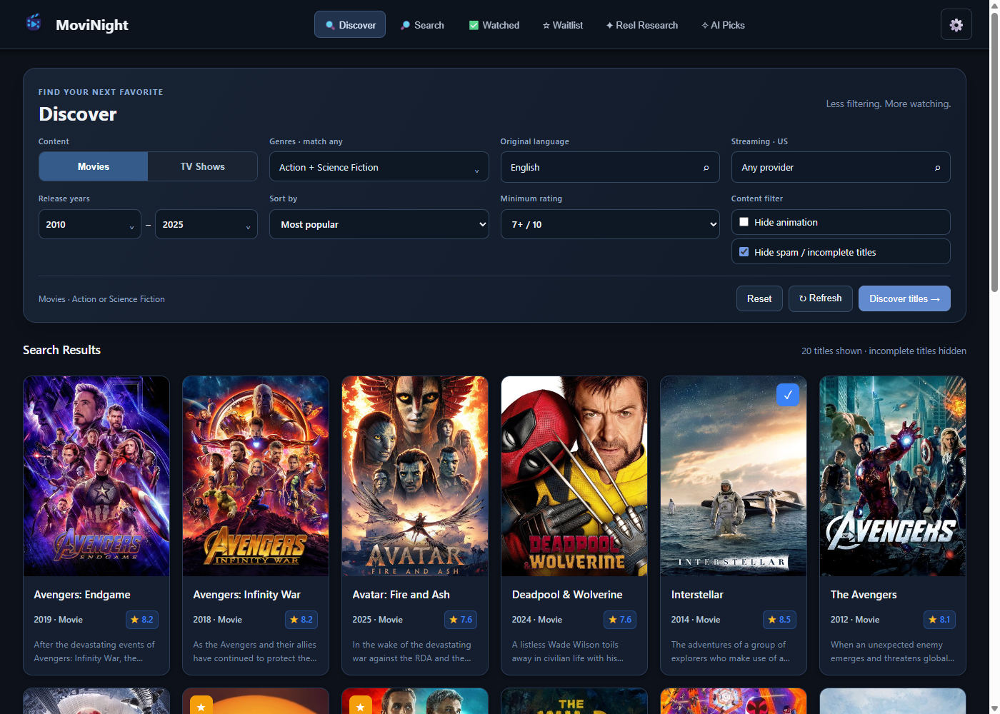

### Research → verify → approve

Paste a table in **Reel Research**. A connected MCP client searches TMDB, checks title/year/format, and stages matches. Review verified matches as poster cards, then open details for the original request and matching explanation. Approve or remove a match from either the card or popup; only approval adds it to Waitlist.

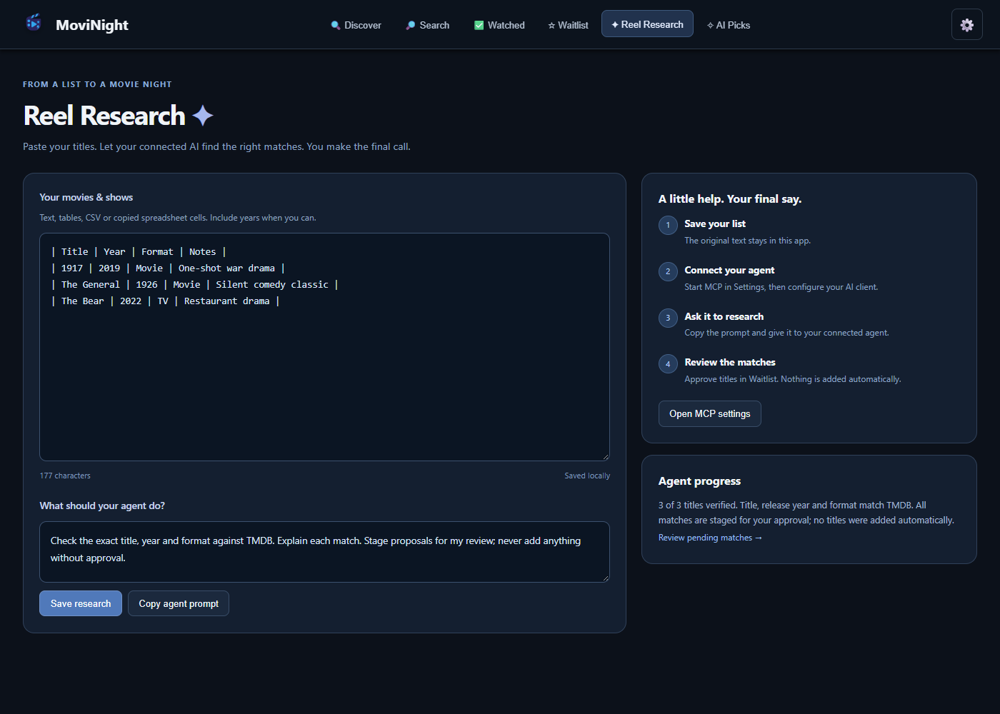

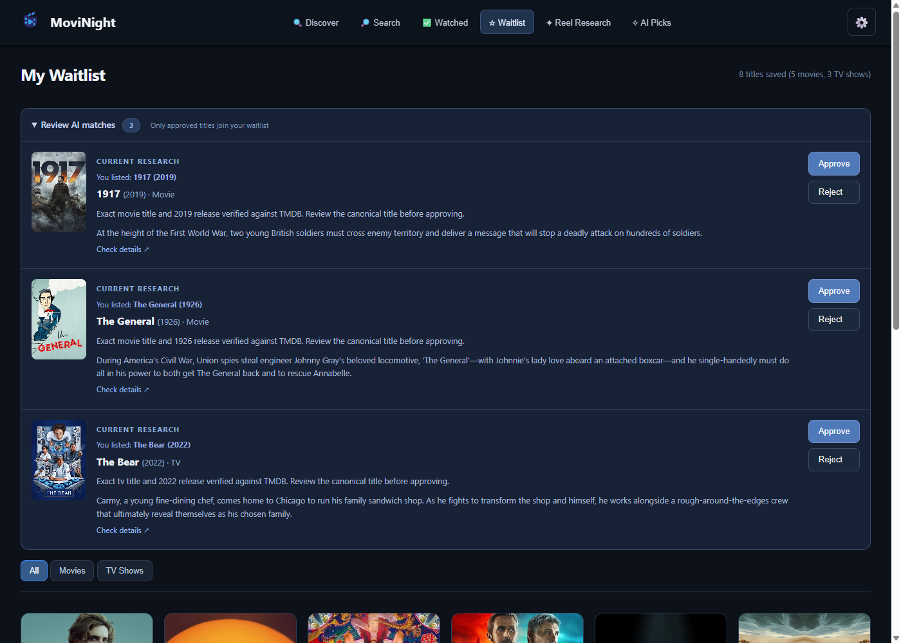

### AI research and Suggestions

Use **Suggestions** for research across Discovery, a new watch from your waitlist, or a rewatch from history. Connected agents can absorb up to 1,000 useful title records per call, continue with the next batch, and use the same filter menus as you. Review pending picks and keep an approved history. Watched approvals preserve dates and season progress; aired unwatched season recommendations also appear in **Watched → AI season suggestions**.

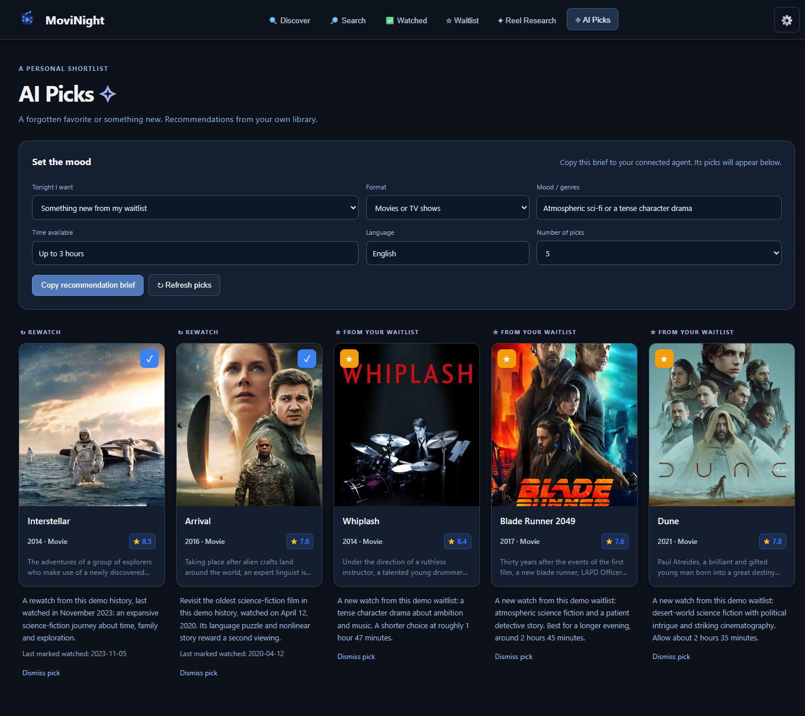

<strong>See search, libraries, season tracking and connection controls</strong>

**Title search** spans movies and TV shows and supports more results.

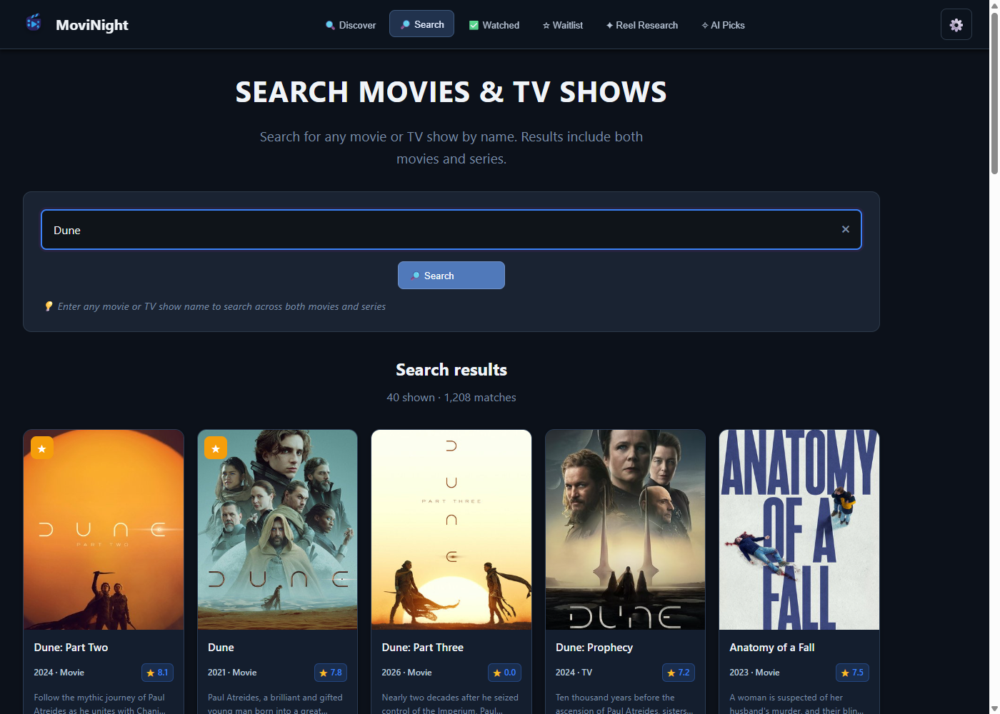

**Watched** keeps dates and tracked seasons; **Waitlist** keeps your approved choices.

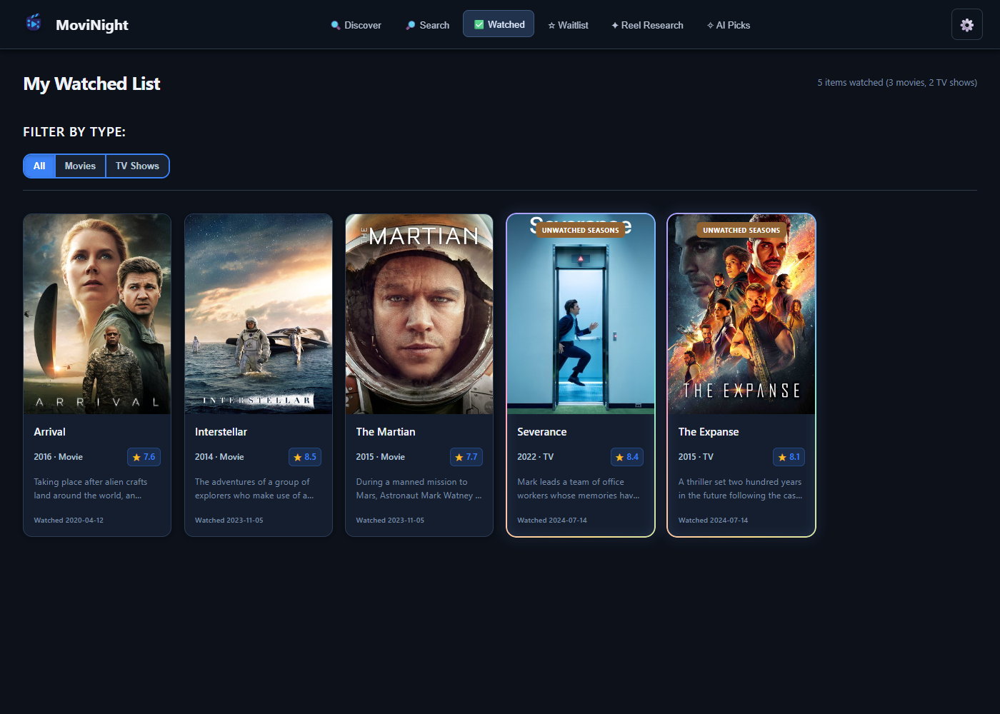

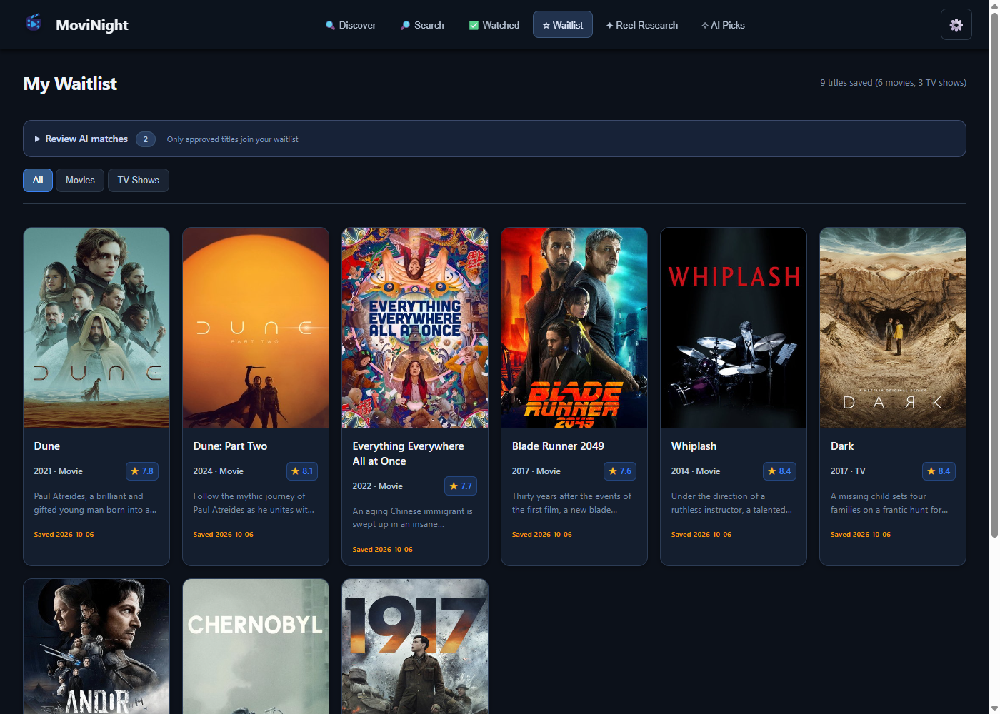

**Season tracking** lives alongside verified TV details.

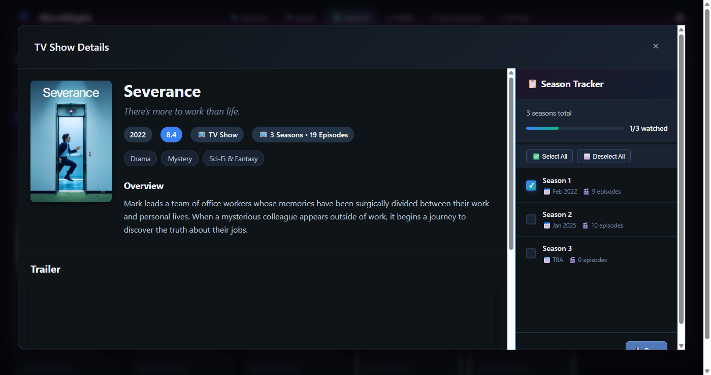

**Streaming platforms** open in a searchable popup, with familiar services first.

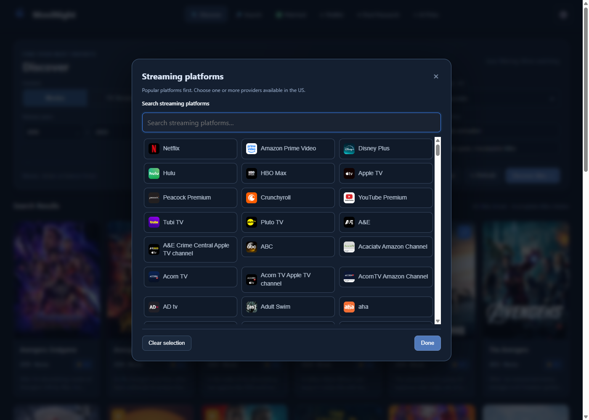

**MCP documentation** is available inside Settings with a copy button.

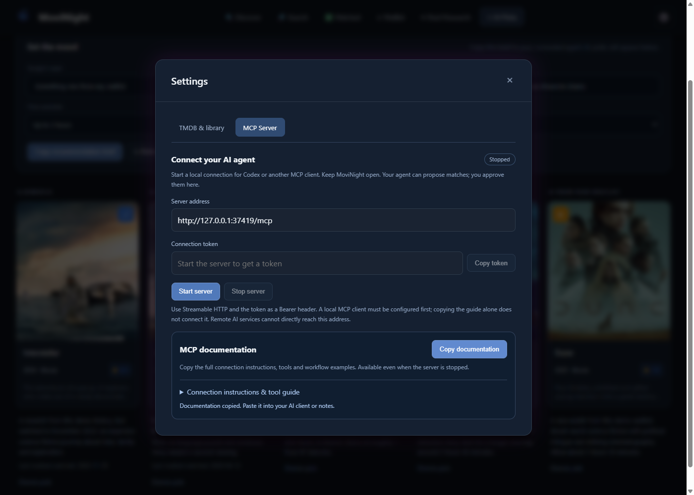

### Your library, even without a connection

Downloaded metadata and images stay on this device. Choose a cache limit, disable caching, or clear **only Discover** while retaining saved-library and other downloaded data.

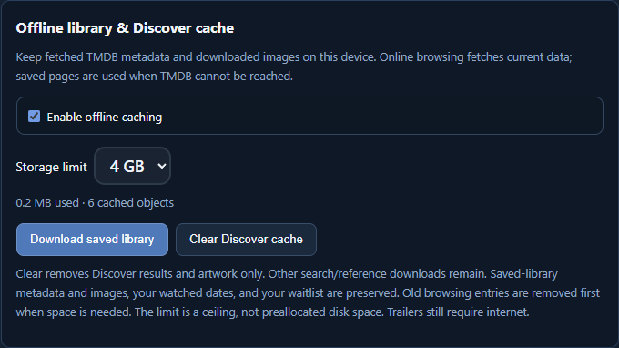

*The GIF and screenshots are captured from the real app with an isolated demonstration library and sample dates. Matches and suggestions were published through the actual MCP tools; no personal library or credentials are shown. AI reasoning requires your connected client.*

## What you can do

| Feature | How it helps |
| --- | --- |
| **Offline library** | Keep fetched metadata, posters and thumbnails locally. Browse downloaded Discover pages offline; online requests still refresh from TMDB. |
| **Cache controls** | Enable or disable caching, choose a 1–5 GB cap (4 GB default), and clear only Discover cache while preserving saved-library downloads. |
| **Comfortable display** | Adjust and save app zoom from 75% to 175% in Settings. |
| **Streaming & languages** | Search large lists in dedicated popups, with familiar streaming platforms first. |
| **Discover & search** | Filter by year, genre, language, rating and providers. Selected genres match **any** selection. Search both movies and TV shows by name. |
| **Waitlist & watched history** | Save titles for later, record watched dates, and track watched TV seasons. |
| **Cleaner discovery** | Optionally hide missing posters and titles rated exactly 0 or 10, alongside the animation filter. |
| **Title details** | Browse metadata, seasons and trailers from TMDB. |
| **Reel Research** | Save pasted lists or tables locally. A connected AI agent searches TMDB and proposes verified matches for your approval. |
| **Suggestions** | Request recommendations from your approved waitlist or revisits from your watched history. |
| **Copy documentation** | Open **Settings → MCP Server → Copy documentation**. Copy the entire guide even while the server is stopped. |

## Get started

1. Install MoviNight using an installer built for your platform.
2. Get a [TMDB API key](https://www.themoviedb.org/settings/api).
3. Open **Settings → TMDB & library**, enter the key, and save.
4. Explore **Discover**, add titles to **Waitlist**, and track them in **Watched**.

### Bring your AI agent

Open **Settings → MCP Server**, start the server, and configure a local MCP client with the displayed address and connection token. Use **Copy documentation** for the full setup guide, tool descriptions and example prompts.

In **Reel Research**, paste your titles, save the batch, and copy the research prompt to your connected client. Review proposed matches in **Suggestions → Research matches** before approving them.

MoviNight does not include an AI model. Research and recommendations come from your connected client. The MCP server listens on loopback; remote services cannot connect to it directly. Agents can propose titles and publish picks, while approval stays in the app. MCP instructions tell connected agents to publish researched recommendations to Suggestions, even without a pasted list.

See the [complete MCP guide](MCP_GUIDE.md).

## Your library & upgrades

Install **1.3.3** over your existing installation using the same installation scope. The app identifier and saved-data location remain the same; uninstalling or clearing your library is unnecessary.

Use **Settings → Data transfer** to export your progress as a portable ZIP with saved-title thumbnails, watched dates and seasons, waitlist, research, pending approvals, suggestions, and preferences. Browsing cache is excluded. Including your TMDB API key is optional. Preview an import, then merge with current progress or explicitly replace it; the app creates a recovery backup first. See the [snapshot format and merge rules](SNAPSHOT_FORMAT.md).

On Windows, data lives in **%APPDATA%\movinight**:

| File | Contents |
| --- | --- |
| watched.json | Watched titles, dates and tracked seasons |
| white_list.json | Approved waitlist |
| config.json | Local TMDB configuration |
| ai_workspace.json | Research, proposals and AI suggestions |

Writes are atomic. Original library files are preserved under **backups/before-1.1.0**, and the last valid file is kept as a **.bak** copy. Malformed files are preserved and reported rather than overwritten. Create an additional timestamped backup through **Settings → Back up library**.

## Offline storage

The offline cache uses a SQLite index and disk objects under **%APPDATA%\\movinight\\offline**. It grows as you browse; the 4 GB default is a maximum, not a reserved allocation. Choose up to 5 GB in Settings. Old browsing entries are evicted first, with saved-library downloads given priority. The cap includes headroom for the index and atomic writes.

Saved cards and watched dates already live locally. With caching enabled, the app downloads metadata and artwork for saved titles in the background; **Download saved library** lets you retry or complete those downloads. Viewed Discover/search pages, title details and reference lists are persisted with their full fetched JSON. Visible posters and provider thumbnails are downloaded at bounded sizes.

Online requests use current TMDB responses (or the short-lived session cache). Persistent data is used only when a network connection fails or TMDB is unavailable, with a banner identifying cached data. Authentication and rate-limit failures are reported rather than covered by stale responses. Offline filters and pages must have been fetched previously; this is a personal cache of browsed content, not a complete TMDB mirror. Video trailers still need internet.

**Clear Discover cache** removes only Discover responses and artwork used exclusively for browsing Discover. Other downloaded search/reference data remains. Downloaded metadata and images for saved-library titles remain, along with every watched/waitlist file. Disabling caching stops new downloads and offline fallback without deleting existing files.

## Development

Install Rust, Node.js, the Tauri CLI and the native Tauri prerequisites for your platform, then run:

~~~bash
git clone https://github.com/mahostar/MoviNight.git
cd MoviNight
npm install
cargo tauri dev
~~~

The frontend source lives in **dist/** and is embedded by Tauri.

### Check & build

~~~bash
npm run check
npm run test:backend
npm run build
~~~

Production installers are written to **src-tauri/target/release/bundle/**. Windows builds produce NSIS and MSI installers; other platforms require their own native build environment.

Backend checks cover storage compatibility, backups, genre union, cache expiry and request coalescing, approval idempotency, and MCP protocol/security behavior.

Snapshot checks also cover full progress/image round trips, merge idempotency, optional key transfer, invalid archives, and interrupted import recovery. Run `tests/snapshot-runtime-check.cjs` against an isolated debug WebView on port 9233 to exercise export, preview, merge, replacement, saved research, and offline thumbnails through the app UI. Its `--prepare` option creates test fixtures; use an isolated directory under `.qa-data/`. Debug-only `MOVINIGHT_QA_SNAPSHOT_EXPORT` and `MOVINIGHT_QA_SNAPSHOT_IMPORT` can select fixture ZIP paths without a native picker. Release builds ignore these overrides.

Optional WebView runtime checks

The Playwright scripts in **tests/** connect to an isolated debug WebView on port 9229. Install Playwright or set **MOVINIGHT_PLAYWRIGHT_PATH** to an existing module.

Set **MOVINIGHT_QA_DATA_DIR** to an absolute isolated data directory, **WEBVIEW2_USER_DATA_FOLDER** to a separate WebView profile, and **WEBVIEW2_ADDITIONAL_BROWSER_ARGUMENTS** to **--remote-debugging-port=9229** before launching the debug executable. Copy test library files into the isolated directory first.

Then run **npm run test:runtime** and **npm run test:responsive**. Runtime checks stage and approve titles in that test library. Release builds ignore the QA data-directory override.

### Project layout

~~~text
dist/                       Frontend HTML, JavaScript and CSS
src-tauri/src/
  lib.rs                    App commands and library behavior
  api.rs                    TMDB client and response cache
  ai.rs                     Research, proposals and suggestions
  mcp.rs                    Local MCP transport and tools
  storage.rs                Atomic persistence and backups
  offline.rs                SQLite index, image downloads and bounded eviction
branding/                   Original branding, demo and screenshots
tests/                      WebView runtime and layout checks
MCP_GUIDE.md                 Client setup and agent workflows
~~~

## Contributing & credits

Issues and pull requests are welcome. MoviNight uses [TMDB](https://www.themoviedb.org/) for movie and TV data, [Tauri](https://tauri.app/) for the desktop shell, and [Rust](https://www.rust-lang.org/) for the backend.

Licensed under [MIT](LICENSE). Built by [Mahostar](https://github.com/mahostar).
