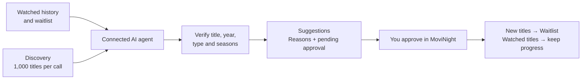

<div align="center">


### Your viewing history. Your next discovery. Your AI agent.

A Windows desktop companion for movies and series, built with **Tauri 2, Rust, and JavaScript**.

Keep a watched library, plan what comes next, and let a connected AI agent research recommendations against your actual progress.

**[Download MoviNight 1.3.3 for Windows](https://github.com/mahostar/MoviNight/releases/tag/MoviNight-v1.3.3)** · **[Documentation](docs/README.md)** · **[Architecture](docs/architecture.md)** · **[Connect your agent](MCP_GUIDE.md)**

**Current source and published Windows installer: 1.3.3**

The release includes Windows x64 setup EXE and MSI installers, checksums, and connection and snapshot guides. The screenshots below show the 1.3.3 interface.

</div>


## A library your agent can understand

Most recommendation prompts start without your viewing history. MoviNight gives a connected local MCP client access to your watched titles, waitlist, and tracked seasons, plus tools to explore the TMDB catalogue.

An agent can read **1,000 useful title records per Discovery call**, continue with the next thousand, verify its picks, and publish them to **Suggestions** with an explanation. You approve the results inside the app.




MoviNight supplies the context and tools; your configured MCP client supplies the AI. Keeping the app open and starting its MCP server enables the connection. It does not run a model or start research on its own.

## Find the gaps in your watch history

Search **All**, **Movies**, or **TV Shows**. Combine release years, original language, match-any genres, minimum rating, streaming providers, and sorting. Cards show whether a title is already watched or waiting.

The agent gets the same Discovery filter capabilities, with larger research batches and compact metadata: titles, descriptions, ratings, vote counts, dates, and relevant progress. Poster and trailer URLs stay out of MCP research responses.


Provider availability in the UI uses the **US region**. MCP queries can select a region. All interleaves independently ranked movie and TV results. The incomplete-title filter hides missing posters and ratings of exactly 0 or 10; it is a metadata heuristic, not a spam classifier.

## Research a list, then review the matches

Paste text, Markdown tables, CSV, or spreadsheet cells into **Reel Research**. Save the batch and ask your connected agent to check title, release year, and format against TMDB. Proposals become poster cards in **Suggestions → Research matches** and **Waitlist → Review AI matches**.


Open a card to compare the original request with the canonical title and matching explanation. Approve or remove a match from its card or detail popup.

<details>
<summary><strong>See the research workspace and detailed match review</strong></summary>


</details>

## Keep your history and season progress

**Watched** records saved viewing dates and checked TV seasons. **Waitlist** holds titles you plan to watch. Search and Discovery use the same poster-led cards and detail actions.

When you approve a recommendation for a watched title, it stays in Watched with its dates and season progress intact. Aired, unwatched season recommendations appear in **Watched → AI season suggestions**, including after approval; you check off seasons yourself.


<details>
<summary><strong>See watched history, waitlist and season recommendations</strong></summary>


</details>

## Take your progress with you

**Settings → Data transfer** exports a portable ZIP containing watched titles, dates and seasons, waitlist, research batches, pending matches, suggestions and approved history, preferences, and saved-title thumbnails. Browsing cache is excluded.


The TMDB API key is **optional and excluded by default**. Import previews the archive before applying it. **Merge** is the default; full replacement requires an explicit selection and confirmation. Imports create a recovery backup.

Snapshots transfer directly between MoviNight installations. Other applications can read or convert the documented ZIP/JSON format; they need format support to import it directly. See [the snapshot specification](SNAPSHOT_FORMAT.md).

## Explore everything

| Capability | What you can do |
| --- | --- |
| Discovery | Browse movies, TV, or both; combine years, genres, languages, ratings and providers. |
| Title search | Search movie and TV names together, then load more results. |
| Details | Open synopsis, ratings, genres, runtime or TV information, and available trailers. |
| Watched & Waitlist | Save plans, viewing dates and season progress; filter libraries by format. |
| Season updates | Check for aired unwatched seasons and review AI season recommendations. |
| AI Discovery research | Give an agent filter menus and up to 1,000 useful records per call, with continuation cursors. |
| Reel Research | Save pasted lists, verify ambiguous matches, and revisit saved research batches. |
| Suggestions | Review discoveries, waitlist picks, rewatches and seasons; retain approved history. |
| Approval control | Agents propose; you approve. Watched progress survives approval, with duplicate handling. |
| Offline downloads | Keep fetched metadata and artwork on this device; retry saved-library downloads. |
| Cache management | Toggle caching, set a 1–5 GB cap (4 GB default), and clear only Discovery browsing data. |
| Portable snapshots | Export progress and thumbnails, preview imports, merge or replace, and optionally include the API key. |
| Display & backup | Save 75–175% app zoom and create timestamped library backups. |
| Connection documentation | Copy the complete MCP guide from Settings, even with the server stopped. |

Read the [user guide](docs/user-guide.md), [architecture and data flows](docs/architecture.md), [current changes](docs/whats-new.md), and [development instructions](docs/development.md).

## Get started

1. Install the [published Windows build](https://github.com/mahostar/MoviNight/releases/latest), or [build current source](docs/development.md).
2. Get a [TMDB API key](https://www.themoviedb.org/settings/api).
3. Open **Settings → TMDB & library**, enter the key, and save.
4. Browse Discovery, save titles to Waitlist, and record progress in Watched.
5. For AI research, start **Settings → MCP Server** and configure your local MCP client with the displayed URL and token. Use **Copy documentation** for setup instructions.

Try asking your connected agent:

> Read my watched series and waitlist. Research popular crime dramas and mysteries that premiered between 2012 and 2022. Explore thousands of titles, exclude what I already saved, verify your best picks, and publish them to Suggestions with reasons.

No pasted list is needed for ordinary Discovery research. See the [complete MCP guide](MCP_GUIDE.md) for client configuration, all 12 tools, batch limits and season rules.

## Local data and offline behavior

On Windows, progress is stored under **`%APPDATA%\movinight`** in `watched.json`, `white_list.json`, and `ai_workspace.json`; local TMDB configuration is in `config.json`. JSON writes are atomic, malformed files are preserved, and last-good `.bak` copies are retained.

The optional offline cache has a **SQLite index and disk objects**. It stores content you fetched, rather than mirroring the whole catalogue. Previously fetched pages and artwork can be reused during connection failures or TMDB server outages; authentication and rate-limit failures remain visible. Trailers require internet. Clearing Discovery cache retains progress and other downloaded data.

The MCP listener is opt-in and bound to **`127.0.0.1:37419`**, with a restart-generated bearer token and Host/Origin checks. The TMDB key is not returned by MCP tools. Your connected agent can receive the library data it reads; use a client you trust. See [data boundaries](docs/architecture.md#data-and-connection-boundaries).

## Development

```bash
git clone https://github.com/mahostar/MoviNight.git
cd MoviNight
npm install
npm run check
npm run test:backend
cargo tauri dev
```

Install Rust, the Tauri CLI and [native prerequisites](https://v2.tauri.app/start/prerequisites/) first. `npm run build` produces native bundles under `src-tauri/target/release/bundle/`. Windows packaging produces NSIS and MSI installers. Other platforms need their own build environment and are not validated by these Windows screenshots.

See [development and verification](docs/development.md) for the source map and isolated runtime checks.

---

**Screenshots:** captured from the actual 1.3.3 desktop WebView with TMDB metadata and a separate demonstration library. Dates, research and recommendation explanations are fixtures; personal viewing history and credentials are not shown. [Capture notes and gallery](docs/screenshots.md).

Built by [Mahostar](https://github.com/mahostar). Metadata and artwork supplied by [TMDB](https://www.themoviedb.org/); this product is not endorsed or certified by TMDB. Powered by [Tauri](https://tauri.app/) and [Rust](https://www.rust-lang.org/). Licensed under [MIT](LICENSE).
