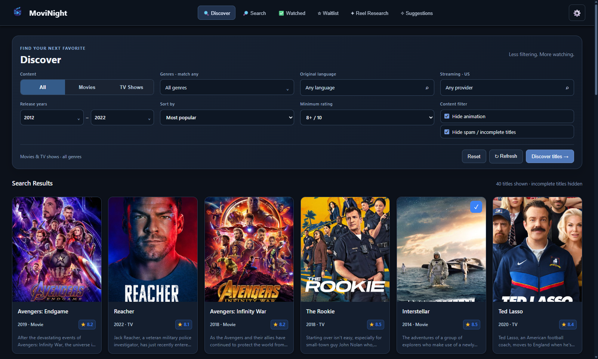

# MoviNight documentation

Documentation for **MoviNight 1.3.3**, checked against the repository and local desktop UI on **8 October 2026**. The published Windows installer is currently 1.3.1; these pages also cover features available in the 1.3.3 source and local build.

| Read | Covers |
| --- | --- |
| [User guide](user-guide.md) | Discovery, search, libraries, seasons, research, approvals, offline behavior and settings |
| [Architecture](architecture.md) | Components, network connections, AI workflow, approval decisions, snapshots and source references |
| [What's new](whats-new.md) | Current UI, large Discovery research, approval history and portable progress snapshots |
| [MCP guide](../MCP_GUIDE.md) | Connection configuration, all tools, research batches and agent behavior |
| [Snapshot format](../SNAPSHOT_FORMAT.md) | ZIP layout, checksums, merge conflicts, replacement and recovery |
| [Screenshot gallery](screenshots.md) | Current captures and how the demonstration data was prepared |
| [Development](development.md) | Prerequisites, build commands, source map and verification scripts |

For installation links and a quick introduction, return to the [project README](../README.md).
