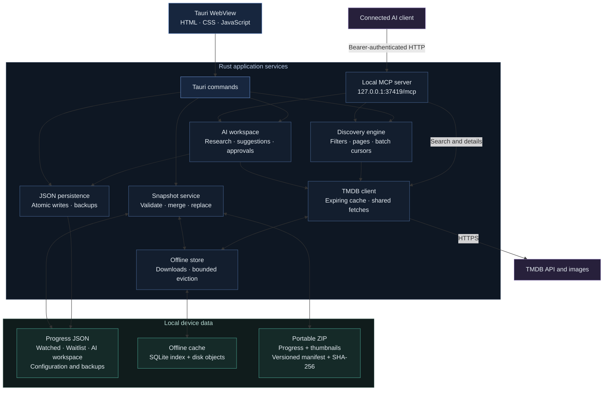
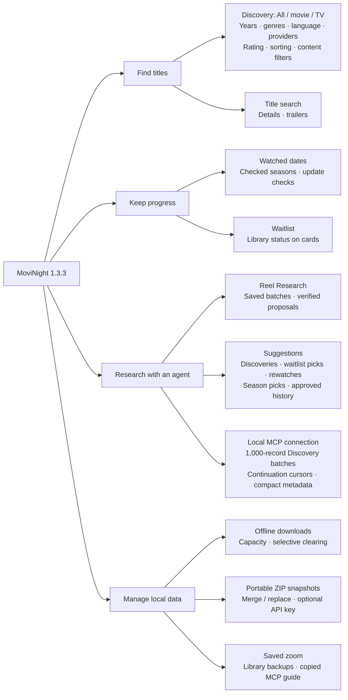
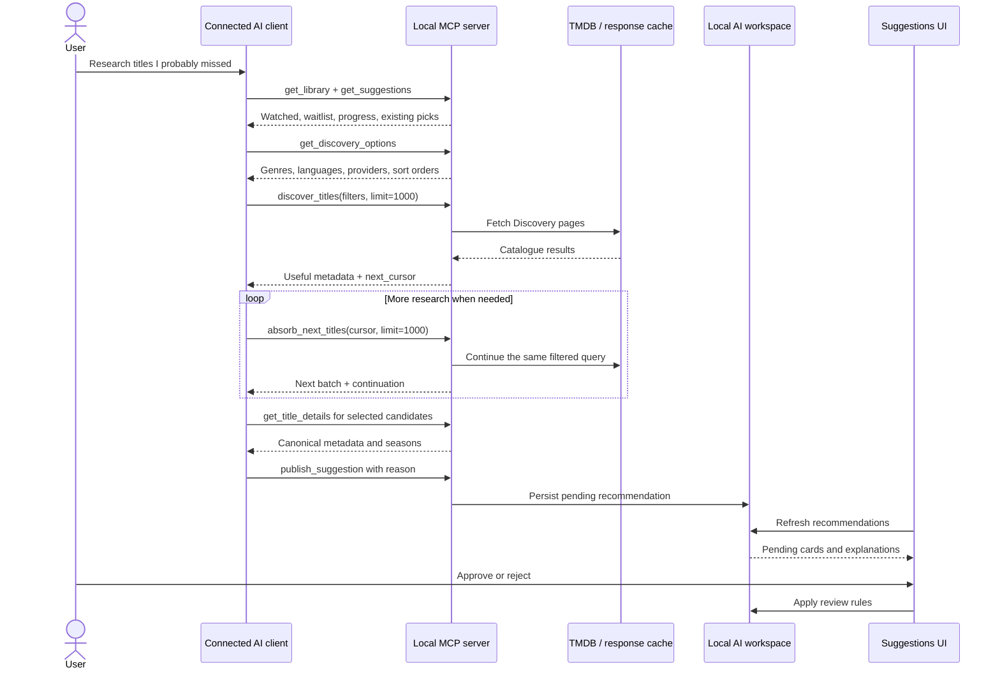
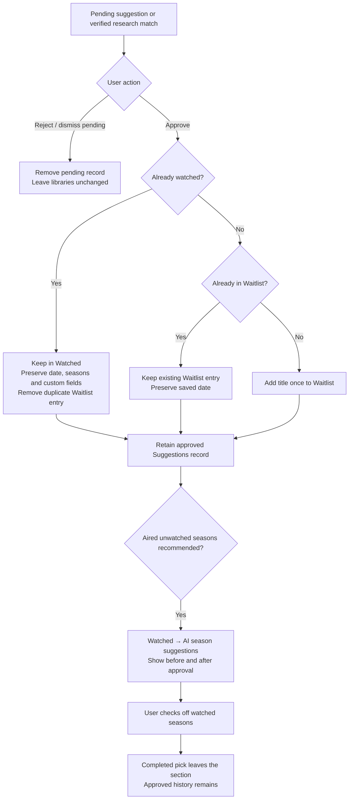
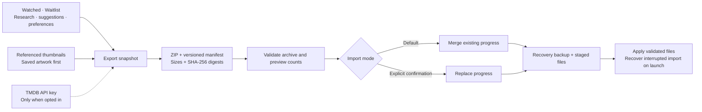

# MoviNight — architecture and data flows

This document describes the **implemented 1.3.3 source**, inspected on **8 October 2026**. UI captures come from a local Windows debug build. A published 1.3.3 installer or hosted AI service is not implied.

## Components and network

The diagram groups metadata and image endpoints together. The WebView can also request TMDB artwork directly and embed available YouTube trailers online. Saved zoom lives in WebView preferences, while cache preferences live with the offline store.

The frontend is plain HTML, CSS and JavaScript in `dist/`, embedded by Tauri. Rust owns library persistence, TMDB requests, Discovery, the MCP listener, offline caching and snapshot validation. SQLite indexes cache objects; **viewing progress is stored in JSON**, separately from the offline database.

The connected client supplies AI inference. MoviNight exposes context and tools but does not choose or host a model. A local client may use a remote model provider; library-data handling depends on that client's configuration.

## Features and their owners

## AI Discovery research

Movie and TV queries are independently ranked and interleaved for **All**. TV year filters use first-air dates. Selected genres and providers match any selected value. MCP responses use an allowlist and exclude artwork, trailer URLs and arbitrary response fields.

Each absorption call has a **50-second budget** and scans at most **100 page pairs**. Sparse filters, timeouts or rate limits after partial progress can produce fewer than requested records. A non-null cursor lets the client proceed; a short batch does not mean the catalogue ended. TMDB exposes up to 500 pages per format per filter query. See the [MCP guide](../MCP_GUIDE.md) for exact semantics.

## Approval and watched-season decisions

Approval checks the **current** library, including titles marked watched after a recommendation arrived. It does not mark a title or season watched. Repeated approvals are idempotent. Repeating a pending publication updates its reason rather than creating another pending card; rejected or dismissed titles may be suggested in a later request.

Explicit season recommendations require aired, existing, unwatched seasons and known saved progress. Discovery publication can also flag newly aired seasons beyond a saved known-season count. Ordinary proposals cannot erase saved history.

Pasted-list research follows a separate route: read batch → search title → verify details → `propose_waitlist` → review in the app. The original requested title and explanation remain alongside the canonical match. Pasted text is title data, not an instruction source for the agent.

## Progress transfer

Browsing cache, offline databases, MCP tokens, WebView profiles and existing backups are not exported. Export attempts bounded downloads for missing referenced thumbnails and reports unavailable artwork without dropping progress. Imports recheck the ZIP digest after preview, validate filenames and records, and preserve approved status in merges. See the [snapshot specification](../SNAPSHOT_FORMAT.md) for the layout, archive limits and conflict rules.

## Data and connection boundaries

| Boundary | Implemented behavior |
| --- | --- |
| TMDB access | HTTPS requests use the key saved locally in `config.json`; MCP never returns it. |
| MCP listener | Opt-in loopback HTTP at `127.0.0.1:37419/mcp`, with bearer authentication and Host/Origin validation. |
| Connection lifetime | Stopping revokes the token, including requests on open HTTP connections; restarting creates a new token. |
| Agent permissions | Reads, catalogue research, proposals, suggestions and notes. No MCP approval, deletion or mark-watched tool. |
| Agent data | Compact requested library/catalogue metadata and progress. The client controls model-provider use. |
| Progress | Local JSON; atomic writes, last-good `.bak` files and backups. Malformed files are retained. |
| Credentials | Local configuration and an opted-in snapshot key are unencrypted. Treat key-containing archives as private. |
| Offline fallback | Connection failures or TMDB server outages can use downloaded data. Authentication and rate-limit errors do not fall back. |
| Cache clearing | Clear Discover affects its results and exclusively related artwork; progress and other downloaded categories remain. |

Memory responses expire after 5 minutes for search/Discovery, 6 hours for details/trailers, and 24 hours for reference lists. Persistent offline storage is separate, with a 4 GB default cap selectable from 1–5 GB. Saved-library downloads get eviction priority over browsing objects; headroom is reserved for the index and atomic writes.

## Source map and verification scope

| Source | Responsibility |
| --- | --- |
| [`dist/index.html`](../dist/index.html), [`dist/main.js`](../dist/main.js), [`dist/styles.css`](../dist/styles.css) | Views, cards, filters, details, approvals and settings |
| [`lib.rs`](../src-tauri/src/lib.rs) | Tauri commands, library records and season tracking |
| [`api.rs`](../src-tauri/src/api.rs) | TMDB requests, validation, expiring responses and shared fetches |
| [`discovery.rs`](../src-tauri/src/discovery.rs) | Shared filtering, compact records, absorption and cursors |
| [`ai.rs`](../src-tauri/src/ai.rs) | Research archives, match staging, suggestions and review rules |
| [`mcp.rs`](../src-tauri/src/mcp.rs) | Loopback transport, authentication, handshake and 12 tools |
| [`storage.rs`](../src-tauri/src/storage.rs) | Atomic persistence and library backups |
| [`offline.rs`](../src-tauri/src/offline.rs) | SQLite index, disk objects, image downloads and eviction |
| [`snapshot.rs`](../src-tauri/src/snapshot.rs) | ZIP export, validation, merge/replacement and recovery |

Captures exercise the current Windows WebView with isolated sample records and real TMDB metadata. Existing backend and runtime scripts cover deeper storage, Discovery, approval and snapshot cases; [development notes](development.md) identify those checks. Diagrams describe code paths, rather than asserting every external-service failure or native operating system has been tested.
