# MoviNight 1.3.3 screenshot gallery

Captured on **8 October 2026** from the actual Windows debug WebView. Most views are 1600 pixels wide; focused research cards use a narrower viewport, and panels are captured directly where useful.

TMDB supplies metadata and artwork. A separate demonstration library has eight watched and eight waitlisted titles, three verified research matches, and five demonstration suggestions covering Discovery, waitlist, rewatch history and an aired season. Dates and explanations are sample data. Personal viewing history, TMDB keys and MCP tokens are not shown. MCP is stopped in its connection capture.

These images show the implemented UI. They do not imply that sample recommendations were independently generated in a fresh MCP session or that a 1.3.3 installer has been published. The watched-library capture shows a completed season recommendation removed from its section; other captures show that same demonstration season still pending.

## Discovery and lookup

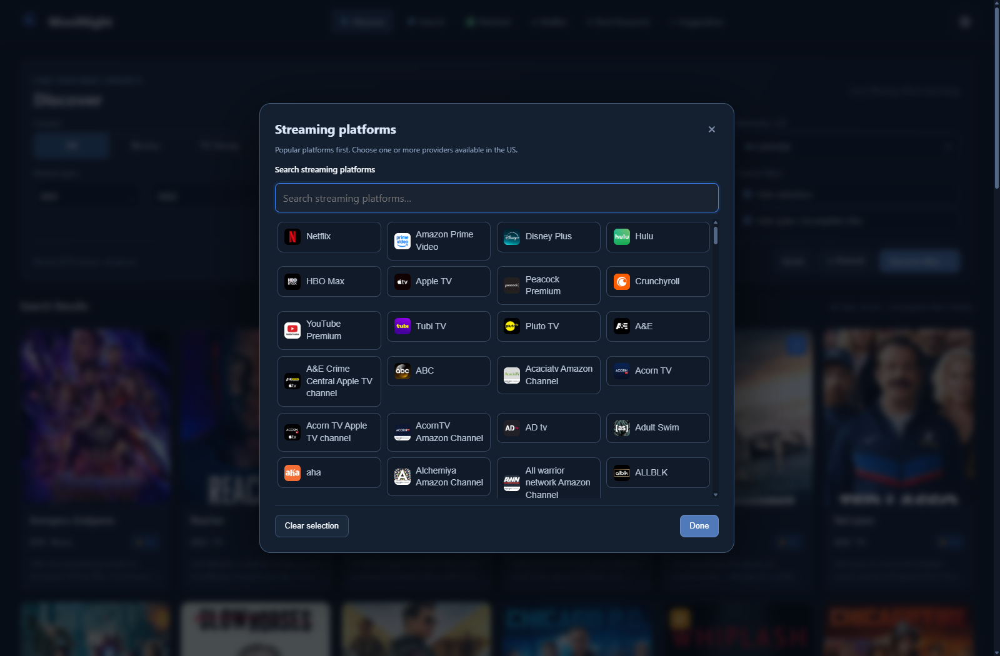

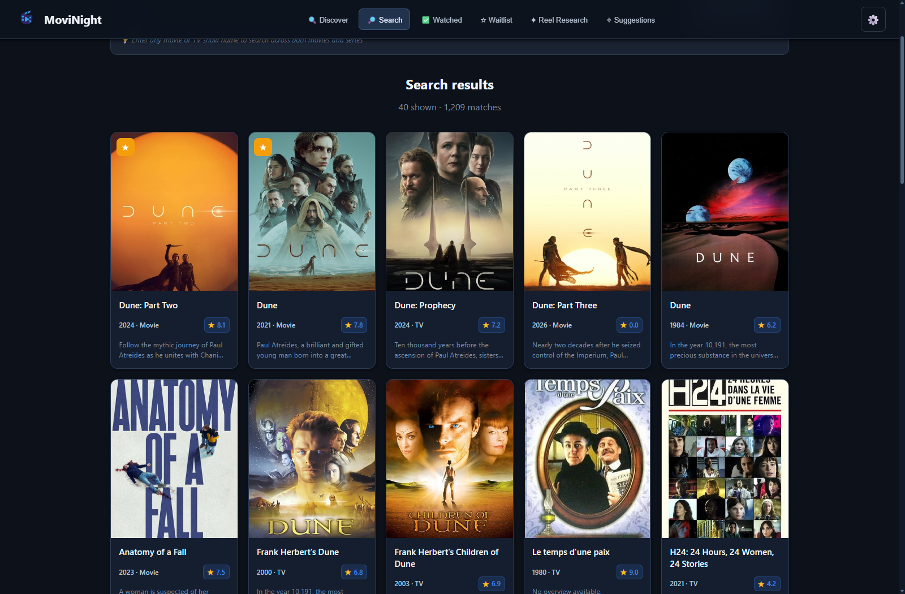

## Libraries and seasons

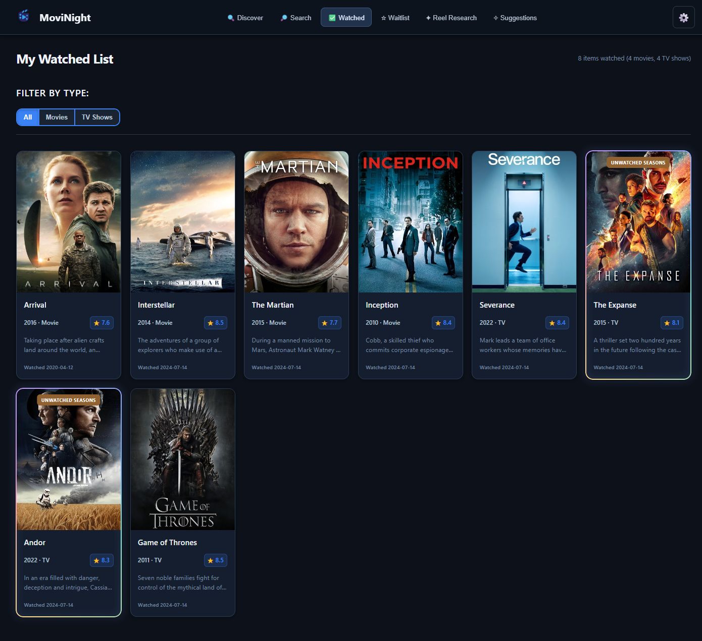

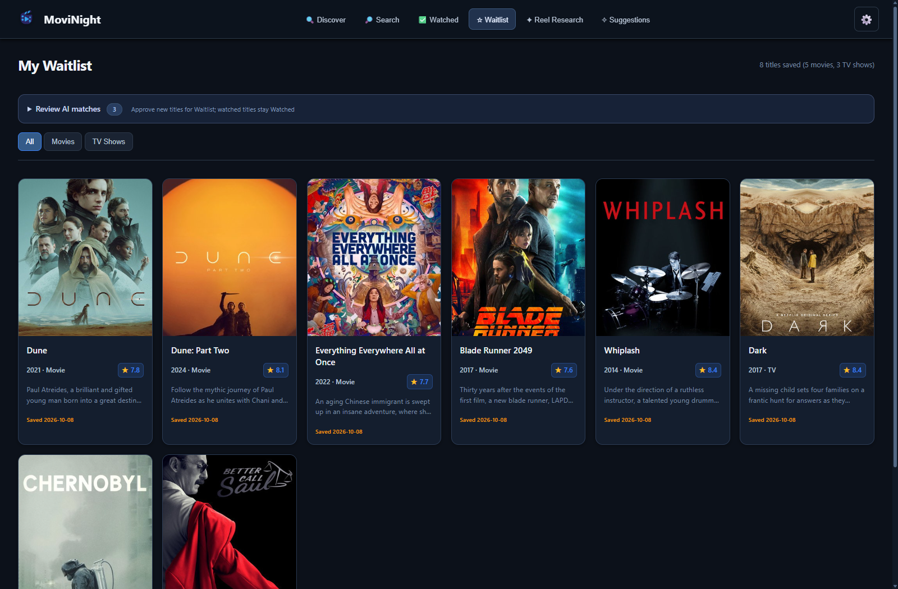

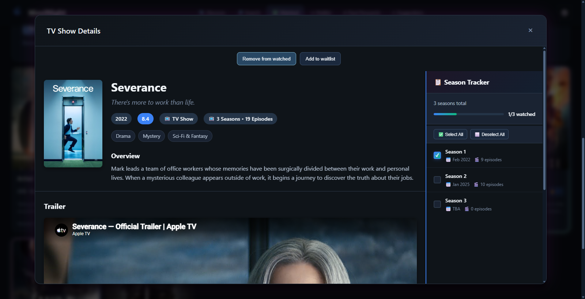

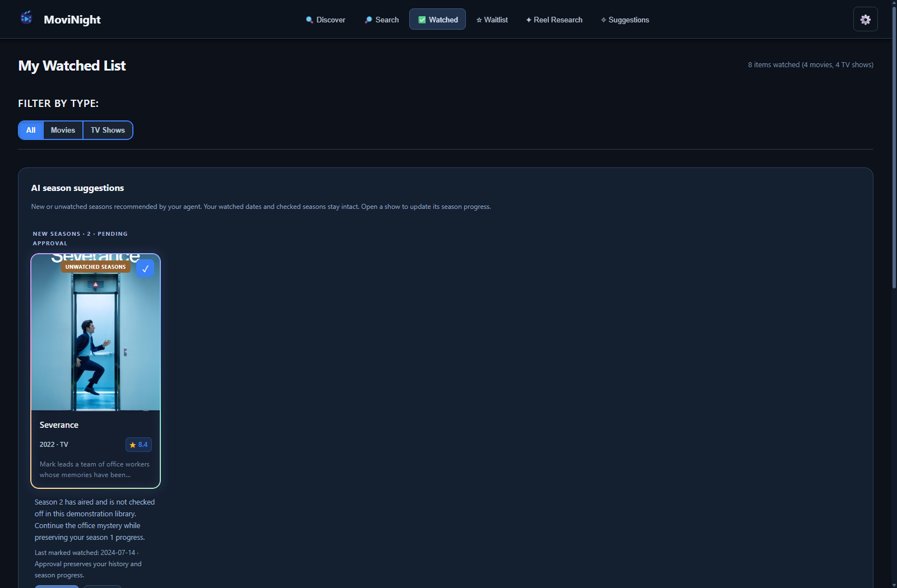

## Research and recommendations

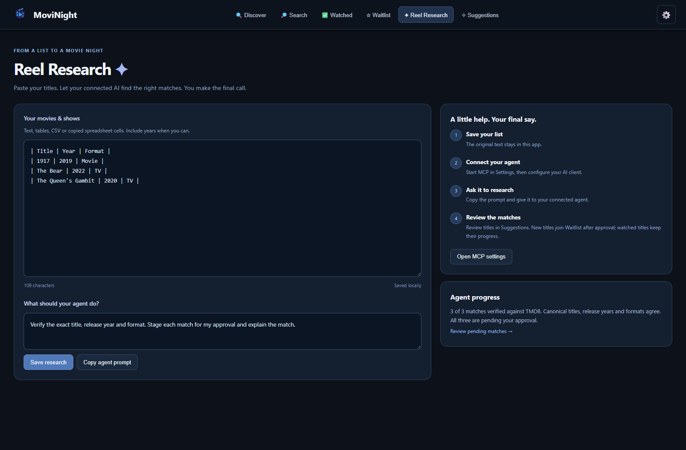

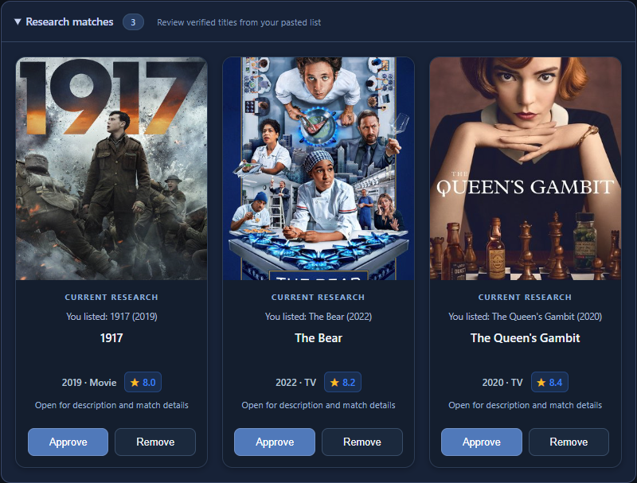

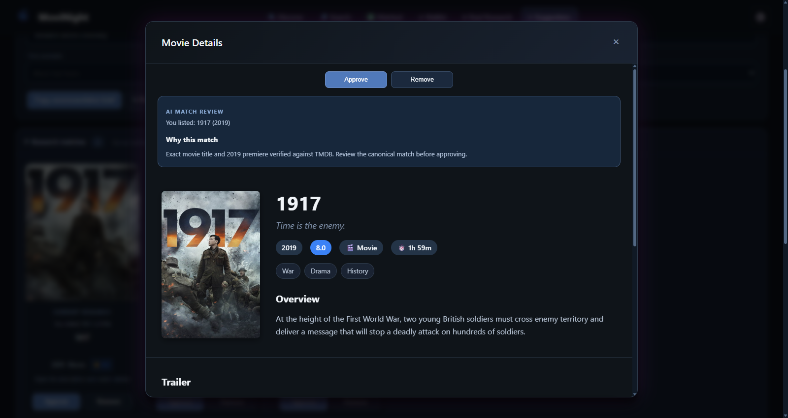

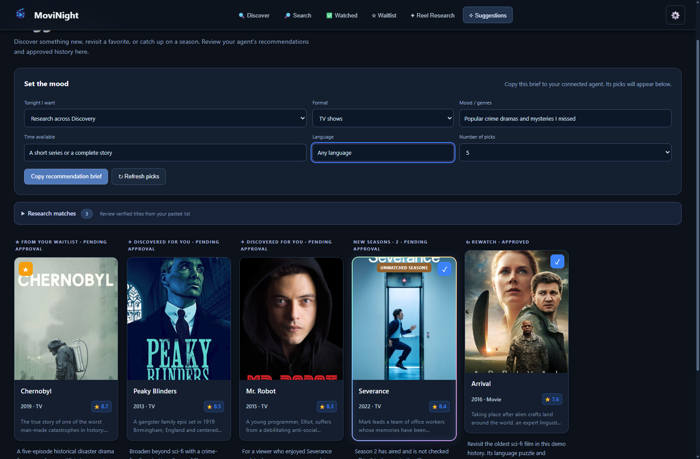

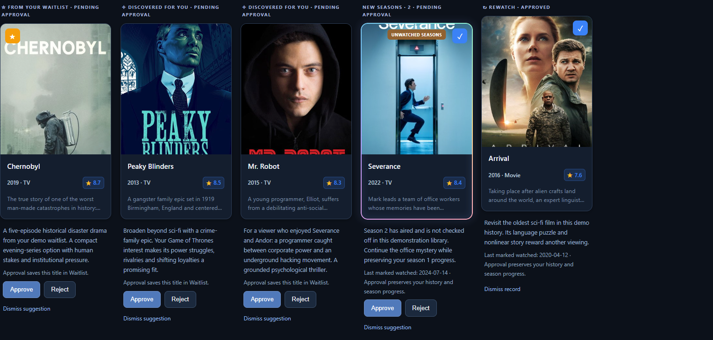

## Transfer and settings

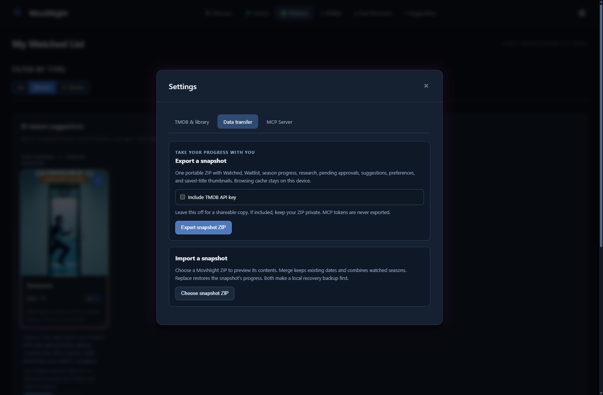

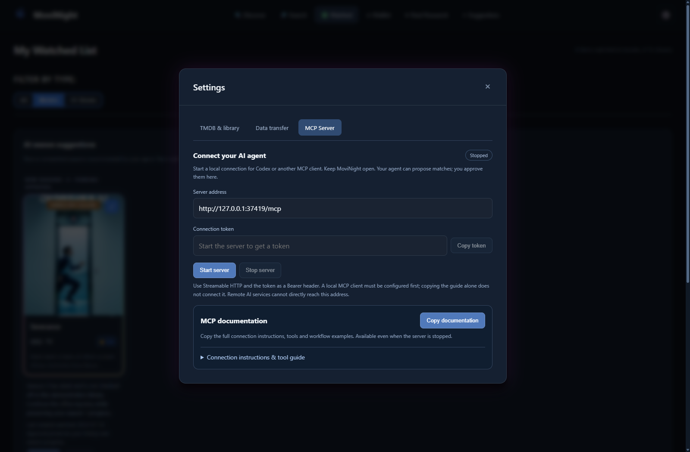

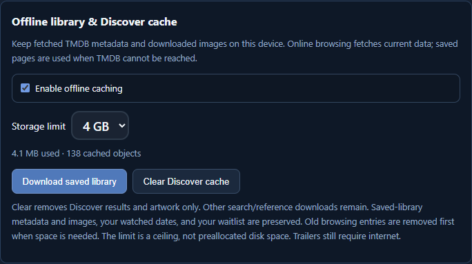
